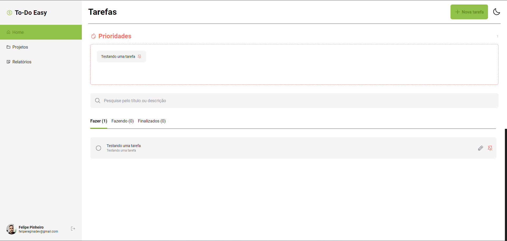

<div align="center">
    
    
</div>

<h1 align="center"> Desafio cotefácil :dollar:</h1>

### To-Do List

[Clique aqui para ir para o to do easy](https://to-doeasy.netlify.app/)




| Mobile | Mobile |
|-|-|
|||


### Requisitos funcionais
- [x] Um usuário deve poder criar uma tarefa
- [x] Um usuário deve poder atualizar uma tarefa
- [x] Um usuário deve poder deletar uma tarefa
- [x] Um usuário deve poder alterar o status da tarefa (Fazer, Feito, Finalizado)
- [x] As tarefas de um usuário devem persistir utilizando localStorage.
- [x] A aplicação deve ser estilizada com CSS
- [x] A aplicação deve conter hooks(useState, useEffect)

### Tecnologias
- React.js
- Styled components
- React toastify
- React router dom
- @phosphor-icons/react

### Visão técnica 
A aplicação foi desenvolvida com Vite e JavaScript | React, seguindo o conceito Mobile First para garantir uma boa experiência em dispositivos móveis, tablets e desktops. Para a navegação entre as rotas (Home, Create, Update), utilizei React Router DOM. Para gerenciar o estado e atualizar os componentes, implementei o contexto. A manipulação de variáveis e eventos foi realizada com os hooks useState e useEffect. Os dados são armazenados em um array de objetos no localStorage. Para a estilização, utilizei Styled Components. Criei uma pasta styles para conter objetos de cores, breakpoints e meu arquivo global. Além disso, para notificações, utilizei React Toastify.

### Como executar a aplicação
Utilizando git, siga os passos abaixo:
```
// bash or powershell
// crie um diretório de projetos
mkdir projects

// entre neste diretório
cd projects

// faça um clone via https
git clone https://github.com/FelipePinheiroRegina/to-do-easy.git

// entre no projeto e instale as dependências
cd to-do-easy
npm install

// execute o projeto
npm run dev

// deploy produção
npm run build
```

### Desenvolvedor

 

 <strong>Felipe Pinheiro</strong>
 
 [LinkedIn](https://www.linkedin.com/in/felipe-pinheiro-002427250/)
 
 [Último projeto](https://github.com/FelipePinheiroRegina/food-explorer-frontend)
